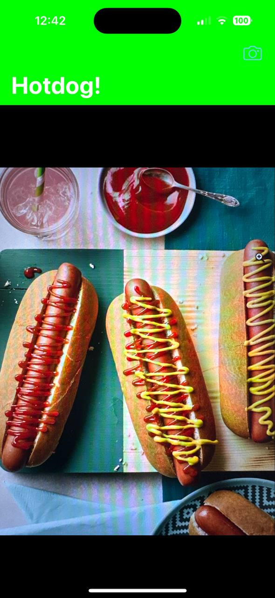

# SeeFood - The Hotdog Identifier

An application that utilizes machine learning to determine whether the picture taken is a hotdog or not. 
-----------------------------------------------------

 
 

## Table of Contents

- [Functionality](#functionality)
- [Tech Stack](#tech-stack)

## Functionality

The app will:

- Allow the user to take or select a picture.
- Analyze the picture using machine learning to determine whether it's a hotdog or not.
- Display the result to the user.

## Tech Stack

The app is developed using:

- [CoreML](https://developer.apple.com/documentation/coreml) - Apple's machine learning framework.
- [Machine Learning](https://developer.apple.com/machine-learning/) - Harnessing the power of machine learning to gain insights from data.
- [UIKit](https://developer.apple.com/documentation/uikit) - A framework for building graphical, event-driven applications in iOS.
- [Vision](https://developer.apple.com/documentation/vision) - A framework that applies high-performance image analysis and computer vision techniques to identify faces, detect features, and classify scenes in images and video.

