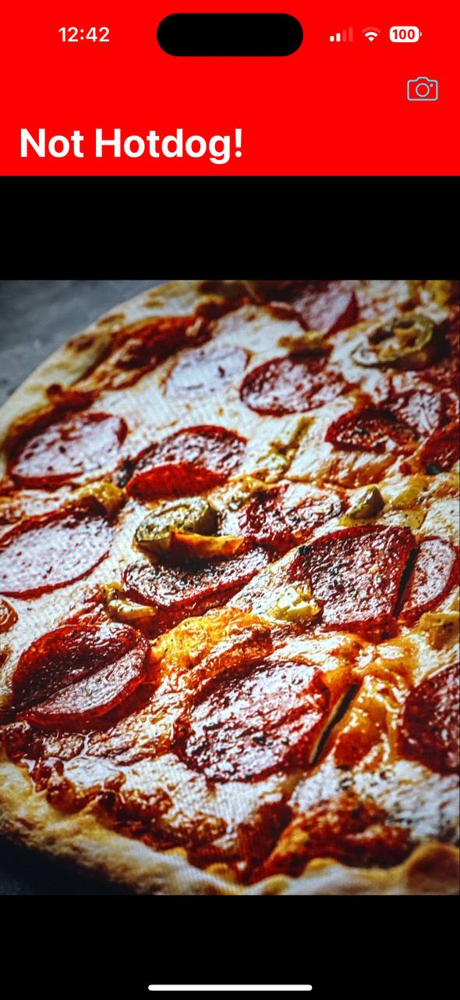

# SeeFood
An app that allows the user to tell if the picture taken is a hotdog or not
Technologies used: 
CoreML, Machine Learning, UIKit, Vision
-----------------------------------------------------

 
 

